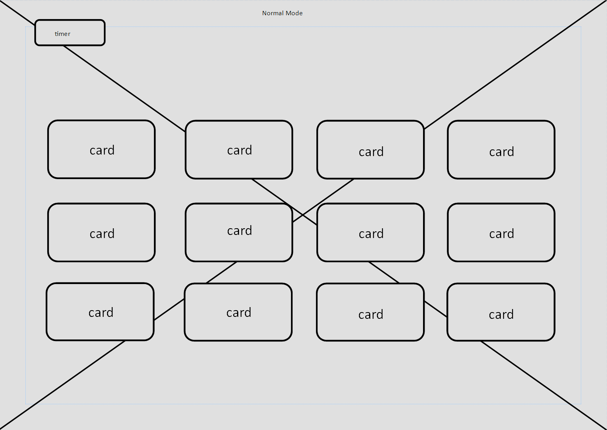
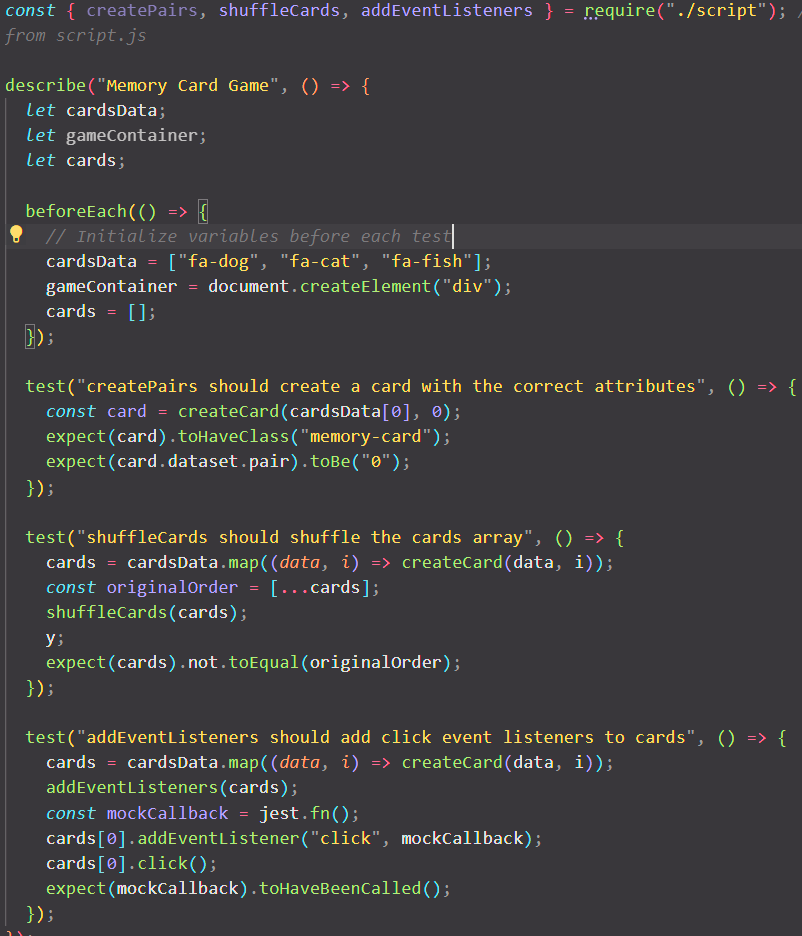

# Memory Card Game

This is a simple memory card game implemented in JavaScript.
Find the game online here: [website](https://alexandermarriott.github.io/milestone-project-2/index.html)

## How to Play

The game starts with all cards face down. The player flips two cards over each turn. If the two cards match, they stay face up. If they don't match, they are flipped back over. The game continues until all cards are face up.

## Features

- The game supports an easy and a hard mode. In the easy mode, each pair of cards has a different color. In the hard mode, all cards have the same color.
- The game uses ARIA attributes for accessibility.
- The game includes error handling for missing game containers, missing cards, and missing icons.

## Code Overview

The JavaScript code for the game does the following:

1. Creates pairs of memory cards. Each pair of cards is created as a `div` element with a class of `memory-card` and a data attribute that identifies the pair. The cards are styled and given ARIA attributes for accessibility. Each card is also given a front and a back, and an icon is added to the front of the card if one is available. The cards are then added to the game container and stored in the `cards` array.
2. Shuffles the `cards` array using the Fisher-Yates shuffle algorithm.
3. Adds an event listener to each card. When a card is clicked, it is flipped over and added to the `flippedCards` array. If two cards have been flipped over, the game checks if they match. If they do, the `matchedPairs` counter is incremented and the `flippedCards` array is cleared. If all pairs have been matched, the game is over and the `gameOver` function is called. If the two flipped cards do not match, they are flipped back over after a delay.

## Future Improvements

- Add a timer to track how long it takes the player to match all pairs.
- Add a score system based on the number of turns taken.
- Add more levels or difficulty settings.
- add database to keep track of high scores.

## Design and U/X choices

These choices were made with simplicity in mind and to draw the users focus mainly to the cards.
Simple game background.
Bold card backgrounds.
Uniform styling to the card icons.

### wireframes

### final site

I think the final site accurately reflects what i set out to do from the beginning. The only variation being the contact us form and confirmation.

## testing procedures

### Automated Testing

Automated tests were written for this project using Jest, a JavaScript testing framework.
all code was also ran through validation services. See results below

#### JS lint

The warnings returned were all expected, mainly caused by having JS create nearly all of the html needed for the game to function (hence the over 80 characters warning).
Also the commas are caused by beautify when saving or copy/pasting the document.
Neither effect game functionality.

#### w3c html checker

#### w3c css validator

### Manual Testing

In addition to automated testing, this project has also been manually tested to ensure everything works as expected. Here are the steps for manual testing:

Open the game in a web browser.
Select a difficulty level.
Flip over two cards. If they match, they should stay face up. If they don't match, they should be flipped back over after a short delay.
Continue flipping over cards until all pairs have been matched. The game should then display a message indicating that you've won.
Test the game in different browsers and on different devices to ensure it works correctly in all environments.

### Differences Between Manual and Automated Testing

Manual testing involves a person performing the tests step by step. It's useful for exploratory testing, usability testing, and ad-hoc testing, and it allows for human observation to find issues automated tests might miss.

Automated testing involves writing scripts to perform the tests automatically. It's useful for regression testing, load testing, and repetitive tasks, and it's more reliable and faster for large codebases or long-term projects.

Both types of testing are important and have their own strengths and weaknesses. A good testing strategy usually involves a combination of both.

## References

Icons are sourced from [fontawesome](https://fontawesome.com/)
The game pop ups use [sweet Alert](https://sweetalert.js.org/)
